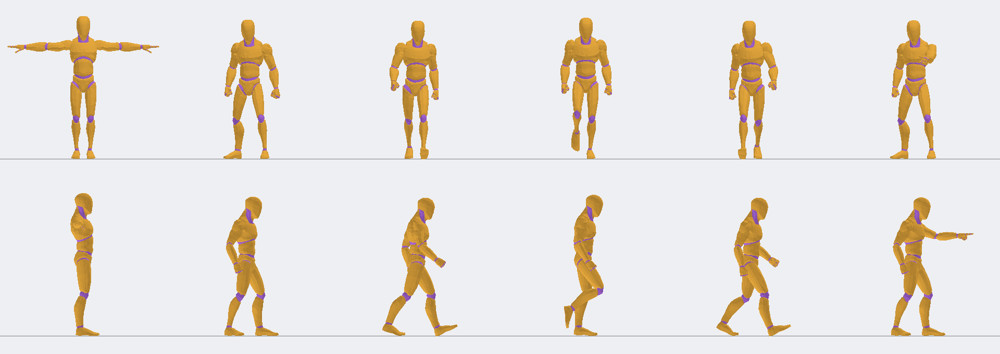

# Prepared neutral mannequin

`test-mannequin.glb` is this game's selected derivative of the embedded
Quaternius Universal Animation Library Standard mannequin. It contains only
`idle`, `walk` and `interact`; no source package, download, retargeting step or
asset converter is needed by an ordinary build or run. The finite C++ catalog
is generated at `src/core/animation/character_catalog.hpp`; `catalog.json`
retains its measured values for inspection. Level files never supply paths.

Treat the header, catalog, derivative and manifest as one preparation result.
Change the preparation script and regenerate them together; hand-editing the
generated header breaks the manifest's recorded output hashes. The compiled
catalog supplies runtime metadata; `catalog.json` is an inspection record.

The original animation archive and extracted GLB are local inputs under the
ignored `build/p07-assets/`, not packaged game resources. The separate Universal
Base Characters archive and Superhero bodies are not used by this derivative.
`manifest.json` distinguishes the original archive/GLB hashes from the prepared
GLB/catalog/header hashes. `LICENSE-Quaternius.txt` is copied byte-for-byte from
the archive's included CC0 notice. The source is
[Quaternius's animation library](https://quaternius.itch.io/universal-animation-library),
Standard edition, itch upload 17958403. Acquisition details remain in the local
download record; this preparation rechecks the archive SHA-256, all ZIP CRCs,
and the extracted model and license against the archived bytes.

Regenerate from the repository root with Python's standard library:

```powershell
python scripts/prepare_character_animation.py --source build/p07-assets --catalog-header src/core/animation/character_catalog.hpp
```

The source root is explicit, checked against pinned hashes, and opened only
for reading. Output inside the source tree is refused. To compare another
complete run without replacing the committed outputs:

```powershell
python scripts/prepare_character_animation.py --source build/p07-assets --output build/character-preparation-check --catalog-header build/character-preparation-check/character_catalog.hpp
```

Both primitives retain their source positions, normals, first UVs, indices,
weights and base-color factors. Preparation removes secondary UVs, 40 other
clips and scale channels. Observed maximum unit-scale drift is 4.7684e-7;
drift above 1e-5 fails. It normalizes rest/key quaternions and recomputes inverse
binds against the unit-scale rest pose, preserving hierarchy and the root's
existing axis conversion. The maximum source/prepared bind displacement is
6.3152e-7 m against the 1e-4 m limit. Both materials become explicit two-sided
opaque diffuse surfaces, metallic 0 and roughness 1, retaining the orange body
and purple joints. No textures, morphs, extensions, animated scales or external
references remain.

The derivative is 959,160 bytes, with 67 nodes, 65 joints, 8,546 source vertices
and 41,232 indices. Each of the three clips has 130 LINEAR translation/rotation
channels. This is a selected asset profile, not a general import promise.

## Calibration and visual reference

The source animation has a visible limitation: sampled soles reach **2.654 cm
below the authored feet plane**. The pipeline preserves that motion. The capsule
and feet origin do not follow the dip, and the proxy does not model limbs.
P07b must retain this limitation when inspecting walking on floors/stairs;
the metadata is not evidence of collision or final animation acceptance.

`evidence/joint-samples.csv` retains ankle, toe and hand positions at 240 Hz.
`evidence/calibration.json` records measurements and their derivation.
All three clips, including endpoints, plus bind geometry were sampled at
60 Hz (355 poses) for preview bounds. The bounds add 5 cm then round outward
to 5 cm. This is a conservative inspection bound for the selected motions,
not a collision shape or a bound for arbitrary animation edits.

| Metadata | Calibrated value / method |
| --- | --- |
| Feet origin | `(0, 0, 0)`; rest sole minimum is 0.000461 m |
| Forward | `+Z`; rest ankle-to-toe horizontal displacement is +0.149000 m Z |
| Capsule | Radius 0.25 m, full height 1.85 m; bind torso radial envelope 0.182745 m and sampled height 1.829178 m, each with 0.02 m margin rounded up to 0.05 m |
| Preview minimum / maximum | `(-1.05, -0.10, -0.55)` / `(1.05, 1.90, 0.80)` m |
| Walk cycle | 1.3061969054512663 m per 1.333333373 s; native speed 0.97964765 m/s |
| Walking contacts | Left heel phase 0; right heel phase 0.5, maximal forward ankle extension |
| Interaction | Left hand's maximum forward reach at 0.733333333 s, phase 0.366666667 |

The capsule derives from the body region between Y=0.8 and 1.3 m and overall
height, excluding moving arms and bind-pose outstretched hands. It is a concrete
upright gameplay proxy for P07b, not full body/limb clearance.

Walk distance fits backward toe motion during the observed planted portions:
left phases 0.125–0.5 and right phases 0.625–1.0. Fitted speeds are 0.97961885
and 0.97967645 m/s; maximum line residuals are 0.0000624 and 0.0001816 m.
The mean fitted speed times duration supplies the cycle distance. Scaling
phase by accepted travel then cancels that planted toe motion at any supported
speed. At P07b's maximum 1.5 m/s, alternating contacts are 0.435399 s apart,
above its 0.20 s minimum; at 0.25 m/s they are 2.612394 s apart. The selected
footstep duration cap of 0.15 s therefore fits the complete speed range.



The six columns are bind, idle at zero, left heel contact, walk at quarter
cycle, right heel contact, and maximum interaction reach. The upper row looks
from +Z; the lower row looks from -X, so forward is right. The horizontal line
is the feet plane. `pose-reference.json` records exact sample times. These
are independent Python CPU-skinned orthographic references with flat face
lighting, not Vulkan captures. Inspection confirms the two colors, upright
scale, planted leading heel with lifted toe, raised swing leg, and the left
arm reaching forward at the interaction marker. The bind pose extends its
arms sideways; it is not a playback clip. Vulkan appearance, interpolated
normals, actual shadows, transitions and recovery require separate viewer
acceptance recorded in the OpenSpec change's validation record.

P07b uses these catalog values directly for accepted-distance route playback.
Zero-actor levels require no mannequin file; selected actors share one immutable
asset and retain independent playback. Blocking blends to idle while preserving
walk phase. Standing turns pivot the entire accepted model at 120 degrees/second.
Physics keeps authored/render/audio feet on accepted ground and derives a private
capsule offset on slopes. There is no foot IK; the measured source sole dip
(2.654 cm), turn pivot and capsule-versus-limb limits remain visible limitations.
The editor's P07b compatibility view shows frozen initial idle poses; P07c adds
dedicated authoring and snapshot inspection.
